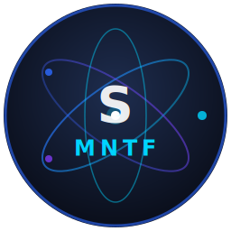

# Shakir MNTF

<p align="center">
  
</p>

### Molecular Dynamics Simulation Software

> **© 2026 Abdul Haseeb Shakir — All Rights Reserved.**
> This software may not be used, copied, modified, or distributed without the
> express written permission of **Abdul Haseeb Shakir**.

---

## About

**Shakir MNTF** is a GPU-accelerated molecular dynamics simulation desktop
application developed entirely by **Abdul Haseeb Shakir**.

It provides a user-friendly alternative to LAMMPS with a modern dark-themed
PyQt6 interface, real-time 3D visualization, and support for multiple
ensembles, force fields, thermostats, and observables.

---

## Features

- Real-time 3D atom visualization (PyVista)
- GPU acceleration via CuPy (CUDA — tested on RTX 4060 Ti)
- Lennard-Jones & Morse force fields
- NVE / NVT / NPT ensembles
- Velocity Verlet & Leapfrog integrators
- Berendsen, Velocity Rescale & Nosé-Hoover thermostats
- Cell-linked list O(N) neighbor builder
- RDF, MSD, density profile observables
- XYZ trajectory, CSV thermodynamics & checkpoint I/O
- Preset simulations: Argon liquid, Argon gas, Copper FCC

---

## Installation

```bash
pip install -r requirements.txt
python main.py
```

**Requirements:** Python 3.12, PyQt6, Numba, NumPy, PyVista, matplotlib, CuPy (optional)

---

## Author & Credits

| Field        | Detail                    |
|--------------|---------------------------|
| **Author**   | Abdul Haseeb Shakir       |
| **Software** | Shakir MNTF               |
| **Version**  | 1.0.0                     |
| **Year**     | 2026                      |

---

## License

**© 2026 Abdul Haseeb Shakir — All Rights Reserved.**

This project is protected under a proprietary license.
**Do not use, copy, or distribute without written permission from Abdul Haseeb Shakir.**
See [LICENSE](LICENSE) for full terms.
